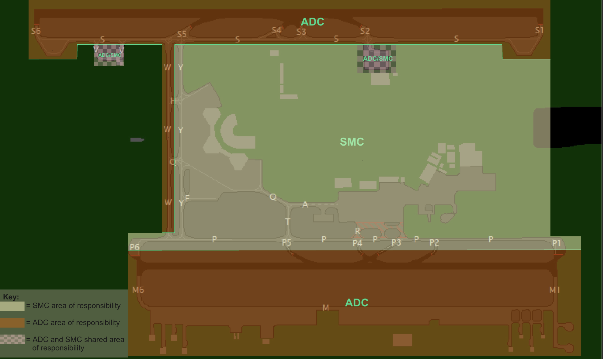

# 2. Areas of Responsibility
## 2.1 Use of Diagrams
Areas marked in orange are the responsibility of the AIR controller(s), while areas marked in yellow are handled by the appropriate GMC controller. Boundaries between these areas are indicated by a green line. Early hand-offs should be used to maintain aircraft movement, and controllers should not wait for aircraft to reach the edge of the boundary before initiating hand-offs.

## 2.2 General Configuration
<figure markdown>

</figure>s