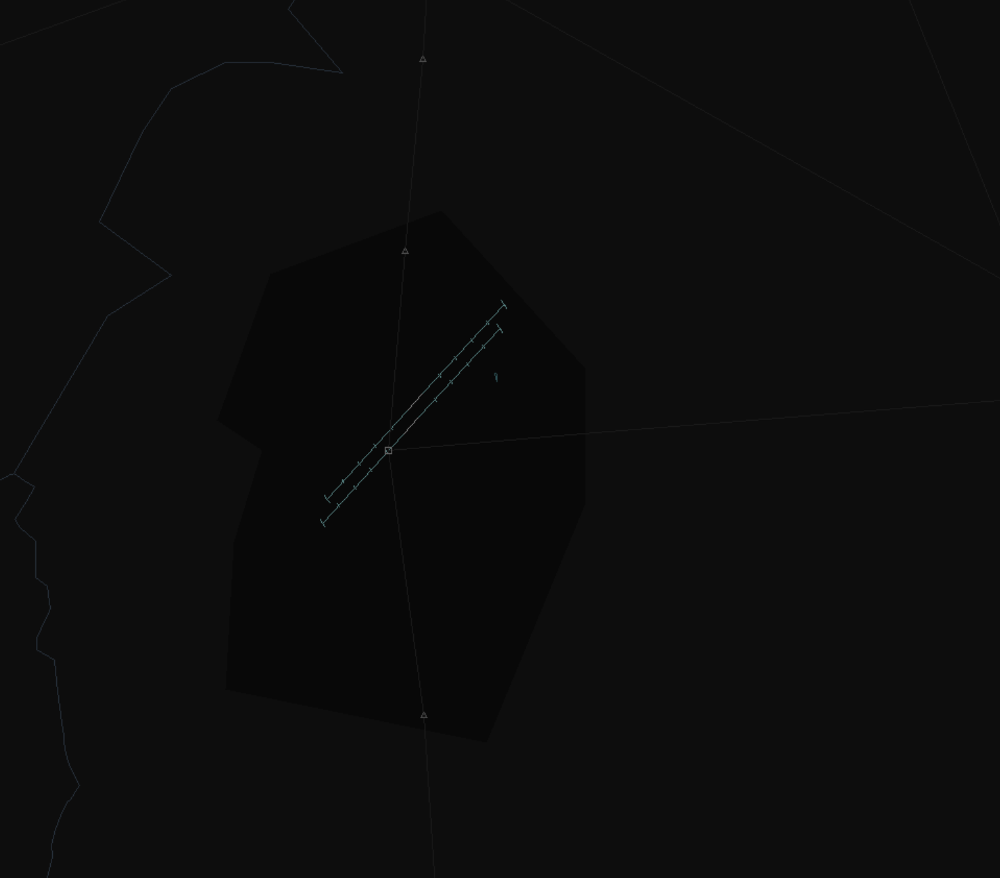

# 3. Areas of Responsibility

--8<-- "includes/abbreviations.md"

## Purpose

The AOR for approach within the Damascus TMA have been specifically design to elimiate procedural services as much as possible, relying on radar as this offers much more accurate position tracking.

**The AOR must be strictly adhered to in order to ensure smoothest and most efficient operations within Damascus TMA**

The AOR on the sector file will be automatically shaded once you connect, so it will be easily identifiable. Vertical limits to AOR is also applicable, to be reminded, the Damascus TMA goes from **1000ft** to **FL155**.

## Level Clearances

When traffic is to be given a climb or descent clearance, the TMA controller may only give a level clearance that is **500ft** offset from the AOR boundary.

If the AOR boundary is 7500ft, a descent clearance may only be given to 8000ft. Likewise, departures may only be given 7000ft. Climb and descent clearances within Damascus TMA is in compliance with level restrictions on SIDs and STARs.

## Damascus TMA

